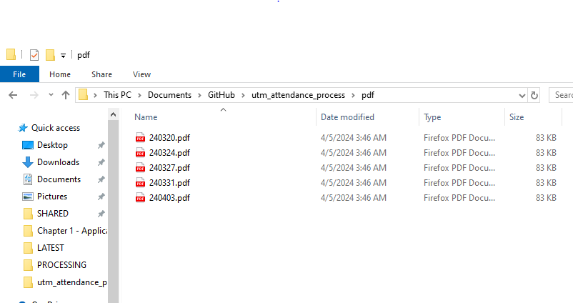

# utm-attendance-process

utm-attendance-process is a python package for processing attendance data in 
UTM, and produce basic statistics of student's attendance

## Usage

### For Windows user

1. Download `dist/windows/process_attendance.exe` and place it inside a
processing folder (eg `Attendance`) to process the attendance data. The
attendance data are the PDF files downloaded from the UTM QR attendance
system.
1. Download the PDF files of the attendance record, placing them inside
a folder named `pdf` created inside the processing folder (eg
`Attendance/pdf`). To ensure the compiled attendance record is compiled
properly, name each of the attendance record according appropriate
format, eg 240301 ('YYMMDD' format). 
1. Double click the downloaded `process_attendance.exe` to process the
   PDF files.
1. `attendance_processed.xlsx` will be generated, containing the
processed attendance information.
