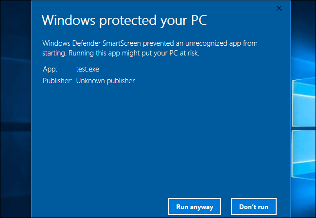

# utm-attendance-process

utm-attendance-process is a python package for processing attendance data in 
UTM, and produce basic statistics of student's attendance

## Usage

### For Windows user

1. Download the software files as `.zip`.
1. Extract the downloaded `.zip` files in a location outside of `Download` folder.  
   - As security measure, newer Windows version will delete downloaded executable files (`.exe`).
2. Create a folder to process the attendance record, eg, `ATTENDANCE_SXXX1234`.
3. Copy the executable file `dist/main.exe` and reminder forms `forms` into `ATTENDANCE_SXXX1234`.
4. Download student attendance records (provided in PDF format) from the UTM QR attendance system into a separate folder, eg, `ATTENDANCE_SXXX1234/pdf`.
5. Name each of the attendance record according 'YYMMDD-HH-D' format, eg 240301-14-2 corresponds to date 01/03/2024, time 14:00, and duration of 2 hours. NOTE: future version will make this file renaming step unnecessary to produce a more efficient workflow.
6. Double click the downloaded `.exe` to open a GUI window. In the GUI, additional settings can be specified (path to attendance record files, attendance exclusions, etc).
   - NOTE: On Windows 11, due to security measures, warning will appear. Click more info, then click `Run anyway` that will appear.
    
7. `attendance_processed-YYMMDD-HH-D.xlsx` will be generated, containing the
processed attendance information. Reminder letters will be automatically generated inside `reminder_letter-generated` folder.
1. To exclude unrecorded attendance for specific students (due to MC, acceptable student activity, forgot to scan and others, etc), create a spreadsheet with student names, and the exclusion can be specified under column `Exclude`. For example, write `240313-08-2, 240320-10-1` to exclude the two classes.
